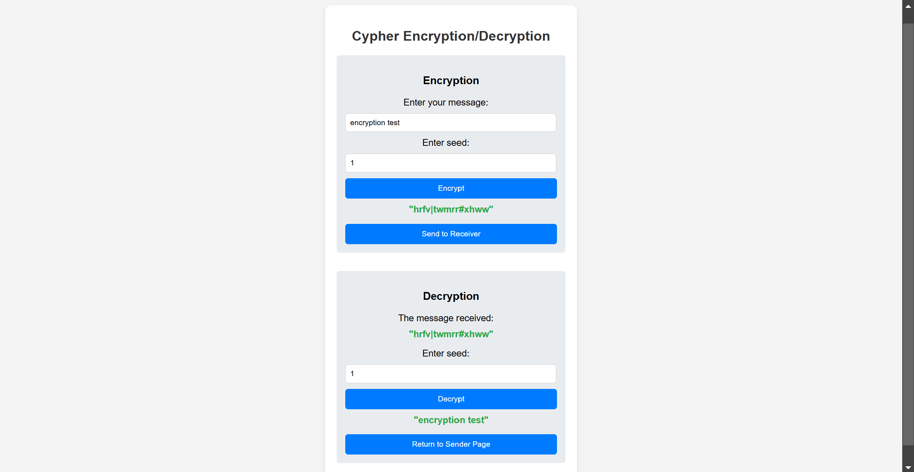

# Encryption Service

This project is a RESTful WCF service for encrypting and decrypting messages with a front-end 
web page built using HTML, CSS, and JavaScript that calls the service. 
The web page allows users to input messages and a seed value to securely encrypt and decrypt text
using the API.

## Built with

- C#
- HTML
- CSS
- JavaScript

## How to use

Download the project by going to the GitHub page, clicking on the green Code button, and then click Download ZIP. Now extract the folder and click on the .sln file to open the project in Visual Studio. In Visual Studio, right click on the Service1.svc file and select View in Browser. Now expand the HTML folder, right click on the index.html file and select View in Browser. To encrypt some text enter some text beneath where it says Enter your message:. Now enter a seed and click the Encrypt button. Send the encrypted text to the reciever by clicking the Send to Receiver button. Now enter the same seed as before and click the Decrypt button to decrypt the text. 

